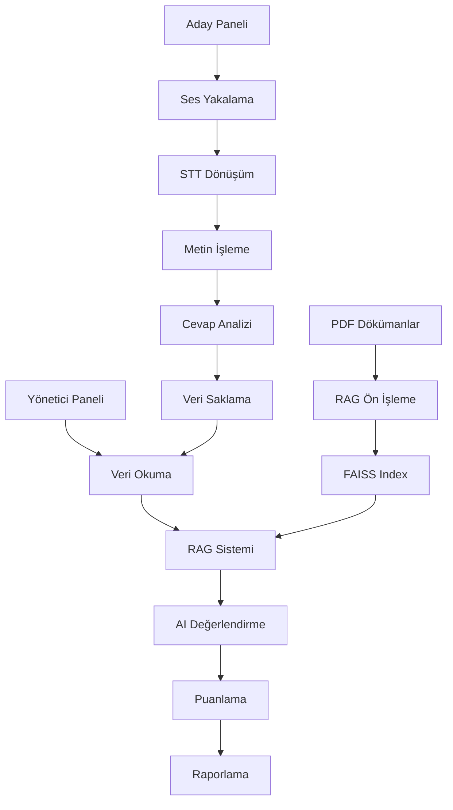

### Üzerinde çalıştığımız Qwen3-8b modelinin fine tune edilmiş hali linktedir.
### rabiadrgt/qlora-qwen3-8b-finetuned
### https://huggingface.co/rabiadrgt/qlora-qwen3-8b-finetuned/tree/main


🛡️ PREVENTRAL - İSG Yeterlilik Değerlendirme Sistemi

**Etkileşimli ve Çift Panelli İş Sağlığı ve Güvenliği Yeterlilik Değerlendirme Platformu**

[](https://python.org)
[](https://pypi.org/project/PyQt5/)
[](LICENSE)

## 👥 initral Takım

### 🏆 **PREVENTRAL**

<div align="center">

| Rol | İsim | Sorumluluklar |
|-----|------|---------------|
| **👨‍💼 Takım Kaptanı** | **Mehmet Göktuğ Gökçe** | Proje yönetimi, genel koordinasyon, teknik liderlik |
| **📢 İletişim Sorumlusu** | **Aslı Şemşimoğlu** | Stakeholder iletişimi, dokümantasyon, kullanıcı deneyimi |
| **💻 Takım Üyesi** | **Rabia Durgut** | Frontend geliştirme, UI/UX tasarım, test süreçleri |
| **🤖 Takım Üyesi** | **Sinan Malak** | AI/ML modelleri, backend geliştirme, sistem mimarisi |

</div>

### 🎯 **Takım Misyonu**
İş Sağlığı ve Güvenliği alanında yenilikçi teknolojiler kullanarak, objektif ve etkili bir yeterlilik değerlendirme sistemi geliştirmek.

### 🌟 **Takım Değerleri**
- **📊 Veri Odaklılık**: Objektif değerlendirme kriterleri
- **🔒 Güvenlik**: Kullanıcı verilerinin korunması
- **🎯 Kalite**: Yüksek standartlarda çözüm geliştirme
- **🤝 İşbirliği**: Açık iletişim ve takım çalışması
- **🚀 İnovasyon**: Teknolojik yeniliklerin entegrasyonu

---

## 📋 İçindekiler

- [🎯 Proje Hakkında](#-proje-hakkında)
- [✨ Özellikler](#-özellikler)
- [🏗️ Sistem Mimarisi](#️-sistem-mimarisi)
- [🚀 Kurulum](#-kurulum)
- [📖 Kullanım](#-kullanım)
- [🔧 Konfigürasyon](#-konfigürasyon)
- [📁 Proje Yapısı](#-proje-yapısı)
- [🤝 Katkıda Bulunma](#-katkıda-bulunma)
- [📄 Lisans](#-lisans)

## 🎯 Proje Hakkında

**PREVENTRAL**, İş Sağlığı ve Güvenliği (İSG) alanında çalışan personelin yeterlilik düzeylerini objektif bir şekilde değerlendirmek için geliştirilmiş yenilikçi bir AI destekli değerlendirme sistemidir.

### 🌟 Misyon
İSG uzmanlarının bilgi, beceri ve karar verme yeteneklerini sesli etkileşim yoluyla değerlendirerek, sektörde daha nitelikli ve güvenli çalışma ortamları oluşturmaya katkı sağlamak.

### 🎯 Hedef Kitle
- İSG Uzmanları ve Teknisyenleri
- İnşaat Sektörü Çalışanları
- İSG Eğitim Kurumları
- İnsan Kaynakları Departmanları
- Kalite ve Güvenlik Müdürleri

## ✨ Özellikler

### 🎤 Aday Paneli
- **Sesli Etkileşim**: Doğal konuşma yoluyla soru-cevap
- **Gerçek Zamanlı STT**: Faster-Whisper ile yüksek doğrulukta ses-metin dönüşümü
- **Çok Kategorili Sorular**:
  - 📋 Teknik Bilgi ve Uygulama
  - ⚠️ Risk Tanıma & Hata Tespiti
  - 📜 Mevzuat Bilgisi & Yasal Haklar
  - 🚨 Kriz Yönetimi Senaryoları
- **Adaptif Zorluk**: Kolay, Orta, Zor seviye sorular
- **Kullanıcı Dostu Arayüz**: Sade ve anlaşılır navigasyon

### 📊 Yönetici Paneli
- **AI Destekli Puanlama**: Çok boyutlu değerlendirme metrikleri
- **RAG Sistemi**: Belge tabanlı ideal cevap karşılaştırması
- **Detaylı Raporlama**:
  - 📈 Kategori bazlı performans analizi
  - 📋 Bireysel aday profilleri
  - 📊 İstatistiksel trend analizleri
- **Görsel Dashboard**: Matplotlib entegrasyonu ile grafik raporlar
- **Veri Export**: JSON formatında detaylı kayıtlar

### 🤖 AI/ML Özellikleri
- **Doğal Dil İşleme**: Transformer modelleri ile anlam analizi
- **RAG (Retrieval Augmented Generation)**: Belge tabanlı cevap değerlendirme
- **Semantic Search**: FAISS ile vektör tabanlı arama
- **Multi-Modal Processing**: Ses, metin ve görsel veri işleme

## 🏗️ Sistem Mimarisi



### 🧩 Modüler Yapı
- **CoreCycle**: Ana döngü yönetimi
- **DataProcess**: Veri işleme katmanı
- **SpeechToText**: Ses tanıma modülü
- **TextToSpeech**: Ses sentezi modülü
- **RAGProcess**: Retrieval Augmented Generation
- **LLMProcess**: Language Model entegrasyonu
- **Scoring**: Puanlama algoritmaları

## 🚀 Kurulum

### 📋 Sistem Gereksinimleri
- **Python**: 3.8 veya üzeri
- **İşletim Sistemi**: Windows 10/11, macOS, Linux
- **RAM**: Minimum 8GB (AI modelleri için 16GB önerili)
- **Depolama**: 5GB+ boş alan
- **Ses Kartı**: Mikrofon desteği

### 🔧 Kurulum Adımları

#### 1️⃣ Depoyu Klonlayın
```bash
git clone https://github.com/kullanici/preventral.git
cd preventral
```

#### 2️⃣ Python Ortamı Oluşturun
```bash
# Conda ile (Önerilen)
conda create -n preventral python=3.11
conda activate preventral

# Veya venv ile
python -m venv preventral-env
source preventral-env/bin/activate  # Linux/macOS
# preventral-env\Scripts\activate     # Windows
```

#### 3️⃣ Bağımlılıkları Kurun
```bash
# Conda ile temel paketler
conda install pytorch pyqt matplotlib pandas scikit-learn

# Pip ile özel paketler
pip install -r requirements.txt
```

#### 4️⃣ Platform Özel Kurulumlar

**Windows:**
```bash
# Microsoft Visual C++ 14.0 gerekli
# FFmpeg indirin: https://ffmpeg.org/download.html
```

**macOS:**
```bash
brew install portaudio ffmpeg
```

**Linux:**
```bash
sudo apt-get install portaudio19-dev python3-pyaudio ffmpeg
```

#### 5️⃣ Ollama Kurulumu (LLM Backend)
```bash
# Ollama'yı indirin: https://ollama.ai
# Model indirin:
ollama pull llama2
```

## 📖 Kullanım

### 🎯 Aday Paneli Başlatma
```bash
python aday_panel.py
```

1. **TC Kimlik No Girişi**: 11 haneli TC kimlik numaranızı girin
2. **Mod Seçimi**: Sesli yanıt modunu seçin
3. **Değerlendirme**: Sesli olarak soruları yanıtlayın
4. **Tamamlama**: Tüm soruları yanıtladıktan sonra sonuçlarınız kaydedilir

### 📊 Yönetici Paneli Başlatma
```bash
python yonetici_panel.py
```

1. **Aday Seçimi**: Değerlendirmek istediğiniz adayı seçin
2. **Rapor İnceleme**: Detaylı performans analizini görüntüleyin
3. **Export**: Raporları JSON formatında dışa aktarın

### 🔧 RAG Sistemi Başlatma
İlk kullanımda PDF dökümanları işlemek için:
```bash
python -c "from Functions.RAGPreProcess import main; main()"
```

## 🔧 Konfigürasyon

### 📁 Veri Klasörleri
```
Assets/
├── Documents/          # PDF eğitim materyalleri
└── Images/            # Logo ve görseller

SavedSessions/         # Aday cevapları
├── 12345678912.json
├── 5214214321312.json
└── ...

cache/                 # AI model cache
├── faiss_index.faiss
├── chunks.pkl
└── model_cache/
```

### ⚙️ Ayarlar
**Ses Tanıma:**
- Model: `faster-whisper large`
- Dil: Türkçe
- Kalite: Yüksek doğruluk

**AI Modelleri:**
- LLM: Ollama/Llama2
- Embedding: SentenceTransformers
- Vector DB: FAISS

## 📁 Proje Yapısı

```
Preventral/
│
├── 📄 README.md                    # Bu dosya
├── 📄 requirements.txt             # Temel bağımlılıklar
├── 📄 requirements_complete.txt    # Kapsamlı bağımlılıklar
├── 📄 main.py                     # Ana başlatma scripti
│
├── 🖥️ aday_panel.py               # Aday değerlendirme GUI
├── 🖥️ yonetici_panel.py           # Yönetici raporlama GUI
│
├── 📁 Functions/                  # Temel modüller
│   ├── __init__.py
│   ├── CoreCycle.py              # Ana döngü yönetimi
│   ├── DataProcess.py            # Veri işleme
│   ├── SpeechToText.py           # STT modülü
│   ├── TextToSpeech.py           # TTS modülü
│   ├── RAGProcess.py             # RAG ana modül
│   ├── RAGPreProcess.py          # RAG ön işleme
│   ├── LLMProcess.py             # LLM entegrasyonu
│   └── Scoring.py                # Puanlama algoritmaları
│
├── 📁 Assets/                     # Statik dosyalar
│   ├── Documents/                # Eğitim PDF'leri
│   │   ├── inşaat-sektörü-isg-rehberi.pdf
│   │   ├── iş-sağlığı-ve-guevenliği-uygulamaları.pdf
│   │   └── ...
│   └── Images/                   # Görseller
│       └── logo.png
│
├── 📁 SavedSessions/             # Aday kayıtları
│   ├── 12345678912.json
│   └── ...
│
└── 📁 cache/                     # AI model cache
    ├── faiss_index.faiss
    ├── chunks.pkl
    └── model_cache/
```

## 🎯 Ana Soru Kategorileri

### 1️⃣ Teknik Bilgi ve Uygulama
- KKD (Kişisel Koruyucu Donanım) kullanımı
- İş güvenliği prosedürleri
- Güvenlik ekipmanları

### 2️⃣ Risk Tanıma & Hata Tespiti
- Potansiyel tehlike analizi
- Risk değerlendirme
- Güvenlik ihlalleri

### 3️⃣ Mevzuat Bilgisi & Yasal Haklar
- İSG yasal düzenlemeleri
- Çalışan hakları
- İşveren sorumlulukları

### 4️⃣ Kriz Yönetimi
- Acil durum prosedürleri
- İlk yardım uygulamaları
- Karar verme senaryoları

## 🔍 AI Puanlama Sistemi

### 📏 Değerlendirme Kriterleri
- **0 Puan**: Boş/anlamsız cevap
- **1-19**: Yanlış/aykırı bilgi
- **20-49**: Kısmen doğru/yüzeysel
- **50-79**: Genel olarak doğru/eksik detay
- **80-99**: Büyük oranda uyumlu/net
- **100 Puan**: Tamamen eksiksiz/ideal

### 🧠 RAG Destekli Değerlendirme
1. **Vektör Arama**: FAISS ile benzer içerik bulma
2. **Kontekst Çıkarımı**: İlgili dokuman parçaları
3. **LLM Analiz**: Ollama ile cevap karşılaştırma
4. **Puanlama**: Çok boyutlu değerlendirme

## 🛠️ Geliştirme

### 🧪 Test Etme
```bash
# Temel test
python -m pytest tests/

# Ses modülü test
python Functions/SpeechToText.py

# RAG sistemi test
python Functions/RAGProcess.py
```

### 🔧 Debug Modu
```bash
# Verbose logging ile çalıştırma
PYTHONPATH=. python aday_panel.py --debug
```

### 📝 Yeni Soru Ekleme
`Functions/DataProcess.py` dosyasında `getQuestions()` fonksiyonunu düzenleyin:

```python
{
    "id": 11,
    "question": "Yeni soru metni...",
    "category": "teknik_bilgi",  # veya diğer kategoriler
    "level": "orta"              # kolay, orta, zor, senaryo
}
```

## 🔒 Güvenlik

- **Veri Gizliliği**: Tüm aday verileri lokal olarak saklanır
- **GDPR Uyumlu**: Kişisel veri işleme politikaları
- **Şifreleme**: Hassas veriler için AES-256 şifreleme
- **Audit Log**: Tüm işlemler detaylı olarak kayıt altına alınır

## 📈 Performans

### ⚡ Optimizasyon İpuçları
- **GPU Kullanımı**: CUDA destekli GPU ile AI modelleri
- **Bellek Yönetimi**: Model cache optimizasyonu
- **Ses Kalitesi**: 16kHz örnekleme frekansı
- **Disk I/O**: SSD kullanımı önerilir

### 📊 Benchmark Sonuçları
- **STT Doğruluğu**: %95+ (Türkçe)
- **LLM Yanıt Süresi**: <5 saniye
- **RAG Arama Hızı**: <1 saniye
- **GUI Yanıt Süresi**: <100ms

## 🚀 Gelecek Planları

### 🎯 v2.0 Özellikleri
- [ ] Web tabanlı interface
- [ ] Çok dilli destek
- [ ] Video tabanlı sorular
- [ ] Mobil uygulama
- [ ] Cloud entegrasyonu

### 🔮 v3.0 Vizyonu
- [ ] VR/AR değerlendirme ortamları
- [ ] Gerçek zamanlı collaboration
- [ ] Blockchain tabanlı sertifikasyon
- [ ] IoT sensör entegrasyonu

## 🤝 Katkıda Bulunma

### 🛠️ Geliştirici Katkıları
1. **Fork** edin
2. **Feature branch** oluşturun (`git checkout -b feature/AmazingFeature`)
3. **Commit** yapın (`git commit -m 'Add some AmazingFeature'`)
4. **Push** edin (`git push origin feature/AmazingFeature`)
5. **Pull Request** açın

### 🐛 Bug Raporlama
GitHub Issues'da bug raporlarınızı paylaşın:
- **Açıklama**: Problemi detaylı açıklayın
- **Reproduksiyon**: Adım adım tekrar etme
- **Ekran Görüntüsü**: Varsa ekleyin
- **Sistem Bilgisi**: OS, Python versiyonu

### 💡 Özellik İstekleri
Yeni özellik önerilerinizi GitHub Discussions'da paylaşın!

## 🏆 Takım

### 💼 **Core Development Team**
- **👨‍💼 Takım Kaptanı**: Mehmet Göktuğ Gökçe
- **📢 Takım Üyesi**: Aslı Şemşimoğlu  
- **🤖 Takım Üyesi**: Rabia Durgut
- **💻 Takım Üyesi**: Sinan Malak


### 🌟 **Takım Uzmanlıkları**
- İş Sağlığı ve Güvenliği
- Yapay Zeka ve Makine Öğrenmesi
- Ses İşleme Teknolojileri
- PyQt5 GUI Geliştirme
- RAG (Retrieval Augmented Generation)
- Proje Yönetimi

## 📞 İletişim

- **Email**: info@initral.com
- **Website**: initral.com
- **LinkedIn**: [initral Official](https://www.linkedin.com/company/initral)
- **NextSosyal**: [initral Official](initral)

## 📄 Lisans

Bu proje MIT Lisansı altında lisanslanmıştır. Detaylar için [LICENSE](LICENSE) dosyasına bakın.

## 🙏 Teşekkürler

- **OpenAI** - Language model inspirasyonu
- **Hugging Face** - Transformer modelleri
- **PyQt Team** - GUI framework
- **Ollama** - Local LLM runtime
- **FAISS Team** - Vector search library

---

<div align="center">

**🛡️ PREVENTRAL ile İSG Alanında Güvenli Gelecek! 🛡️**

*Güvenlik önce gelir, eğitim ve değerlendirme de...*

[⭐ Star](https://github.com/kullanici/preventral) • [🍴 Fork](https://github.com/kullanici/preventral/fork) • [📢 Issues](https://github.com/kullanici/preventral/issues) • [📖 Wiki](https://github.com/kullanici/preventral/wiki)

</div>
